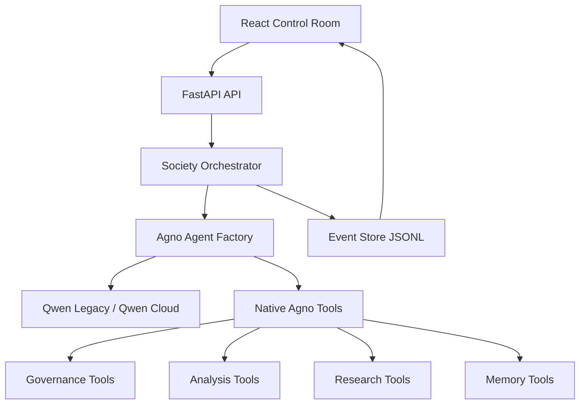

# Qwendom V2 Execution Plan

## Objective

Turn Qwendom from a proof-of-concept society simulation into a real multi-agent system where agents have explicit capabilities, use native Agno tools for governance, and expose their decisions and tool use clearly in the UI.

This plan is intentionally staged. Do not implement all phases at once.

## Current State

The app currently has:

- FastAPI backend and React frontend.
- Qwen Legacy provider support through Agno's OpenAI-compatible model class.
- Four persistent agents: Ada, Ibn, Lin, Noor.
- A temporary spawned child agent: Kai.
- Event-stream UI showing team formation, leader election, negotiation, votes, monitoring, learning, dissolution, and final answer.
- LLM-backed proposal generation and some LLM-backed governance prompts.

The app does **not** yet have:

- Native Agno `tools=[...]` wiring.
- Real tool-call events.
- Capability-scoped toolboxes per agent.
- Durable task replay beyond raw JSONL events.
- Real research/code/document tools.

## Design Principles

1. **Native tools are required**
   - Phase 1 must use native Agno tools through `Agent(tools=[...])`.
   - The configured model is assumed to support tool calls.
   - If a native tool call fails, the task should fail visibly instead of silently downgrading to simulated governance.
   - Deterministic fallback may remain only for no-key local development mode, not for the serious Qwen Legacy path.

2. **Small vertical slices**
   - Each phase must be independently runnable and demonstrable.
   - Avoid a large rewrite of `orchestrator.py` in one pass.

3. **Visible agency**
   - If an agent elects, votes, critiques, spawns, or uses a tool, the UI should show the reason and tool result.

4. **Provider realism**
   - The active Qwen Legacy model must support tool calling.
   - Validation must prove the task used native Agno tool calls.
   - Weak/non-tool models are out of scope for Phase 1.

5. **No hidden magic**
   - Every agent decision should be represented as a structured event.
   - In LLM-enabled mode, native tool failure should be visible as task failure, not hidden behind simulated behavior.

## Target Architecture



## Target Backend Structure

```text
backend/society/
  agents.py
  orchestrator.py
  models.py
  memory.py
  schemas/
    __init__.py
    governance.py
    capabilities.py
  tools/
    __init__.py
    governance.py
    analysis.py
    memory.py
```

Do not add research/web tools in the first implementation slice. Add them only after governance tools are validated.

## Phase 1: Native Governance Tools

### Goal

Make leader election, spawn decision, voting, and peer monitoring use native Agno tools when supported.

### New Schemas

`backend/society/schemas/governance.py`

- `LeaderDecision`
  - `leader_id: str`
  - `reason: str`
  - `confidence: float`

- `SpawnDecision`
  - `spawn: bool`
  - `specialist_role: str | None`
  - `reason: str`

- `VoteDecision`
  - `choice: str`
  - `reason: str`
  - `confidence: float`

- `CritiqueReport`
  - `critique: str`
  - `risks: list[str]`
  - `improvements: list[str]`
  - `confidence: float`

### New Tools

`backend/society/tools/governance.py`

Native Agno tools:

- `elect_leader_tool`
- `decide_spawn_tool`
- `cast_vote_tool`
- `peer_review_tool`

Each tool must be a real Agno tool using `@tool(...)`.

Tool design pattern:

1. The agent reasons from the prompt and available context.
2. The agent must call the relevant tool with its decision as arguments.
3. The tool validates and normalizes those arguments.
4. The normalized tool result becomes the source of truth for the orchestrator.

This means the tool does not independently choose the leader/vote/critique. The agent chooses, and the tool enforces a structured decision contract.

### Agent Factory Changes

`backend/society/agents.py`

Add optional tool support:

```python
def build_agno_agent(identity, settings, tools=None, tool_choice=None, output_schema=None):
    ...
```

Rules:

- Proposal generation: no forced tools.
- Governance decisions: pass one relevant tool and force tool calling.
- Do not combine `tools` and `output_schema` in the same governance call for Phase 1.
- Tool result JSON is the structured contract.
- If a model rejects tool calling, emit `task_failed`; do not silently simulate governance.

Governance calls must inject phase-specific instructions into the agent. Add an optional `extra_instructions` parameter:

```python
def build_agno_agent(identity, settings, tools=None, tool_choice=None, extra_instructions=None):
    instructions = [
        ...base identity instructions...,
        *(extra_instructions or []),
    ]
```

For governance calls, pass instructions like:

```text
You must call the provided governance tool exactly once.
Do not answer in prose.
Put your final decision into the tool arguments.
Use only valid agent ids from the provided roster.
```

### Orchestrator Changes

`backend/society/orchestrator.py`

Refactor these methods:

- `_elect_leader`
- `_spawn_child_agent`
- `_vote`
- `_monitor`

Each should:

1. Try native tool path.
2. Emit a `tool_call` event with tool name, actor, input summary, result, and success status.
3. If native tool path fails while `settings.llm_enabled` is true, mark the task failed with a clear error.
4. If no API key exists, deterministic local development behavior may still run and must emit `mode: deterministic_no_key`.

### Tool Result Extraction

The implementation must include a small helper, for example `_extract_tool_result(response, tool_name)`, because Agno responses may expose tool output differently by provider/model.

Extraction order:

1. Prefer explicit tool-call result/message fields if present on the response object.
2. Fall back to `response.content` only if it contains the tool's returned JSON payload.
3. Validate the extracted payload with the relevant Pydantic schema.
4. If no valid native tool result is found while `settings.llm_enabled` is true, raise a controlled governance error and mark the task failed.

Do not parse normal prose as a governance decision in LLM-enabled mode.

### Event Model Changes

`backend/society/models.py`

Add or standardize `tool_call` event payload:

```json
{
  "tool_name": "cast_vote",
  "actor": "researcher",
  "input_summary": "...",
  "result": {...},
  "mode": "native_agno|deterministic_no_key",
  "success": true
}
```

## Phase 1 Validation

Phase 1 is valid only if all checks pass:

0. Run a preflight native tool-call smoke test against the configured model before the full orchestrator run:
   - Define a tiny `@tool` named `record_decision(choice: str, reason: str)`.
   - Create an Agno agent with `tools=[record_decision]` and forced tool choice.
   - Ask it to choose between `alpha` and `beta`.
   - Validate that the returned response contains an actual tool result, not prose.
   - If this fails, switch model before implementing/running Phase 1.
1. `python -m compileall backend`
2. `cd frontend && npm run build`
3. Backend health reports Qwen Legacy model.
4. Submit a short task via API.
5. Events include at least:
   - `team_formed`
   - `leader_elected` with `reason`
   - `tool_call` for leader election with `mode: native_agno`
   - `vote_cast` with `reason`
   - `peer_monitor_report` with critique payload
   - `task_complete`
6. Submit from UI and confirm timeline renders without duplicate events.
7. Confirm at least one `tool_call` event has `mode: native_agno`.
8. Confirm no governance event in LLM-enabled mode has `mode: deterministic_no_key`.
9. Confirm tool-call loops are bounded with `tool_call_limit` and `llm_timeout_seconds`.
10. Confirm existing lifecycle order still holds: team formed -> leader elected -> spawn/no-spawn -> negotiation -> voting -> monitoring -> learning -> dissolution -> complete.

## Phase 2: Capability Tools

Only start after Phase 1 passes.

Add real capability tools:

- `decompose_task_tool`
- `risk_assessment_tool`
- `memory_lookup_tool`
- `memory_write_tool`

Agent tool scopes:

- Ada: decomposition, architecture, delegation.
- Ibn: memory lookup, context extraction, evidence questions.
- Lin: implementation planning, artifact generation.
- Noor: risk assessment, critique, quality gates.

Validation:

- Each agent must use at least one capability-specific tool in a demo task.
- UI must show tool name and result.

## Phase 3: Frontend Observability

Add UI support for:

- Tool-call rows in timeline.
- Expand/collapse payload viewer.
- Governance reason badges.
- Fallback mode indicator.
- Agent capability badges.

Validation:

- User can visually tell whether an action used native Agno tools or fallback.
- User can inspect vote reasons and peer critique.

## Phase 4: Durable Memory

Add structured memory APIs:

- `GET /tasks`
- `GET /tasks/{id}/events`
- `GET /agents/{id}/memory`
- optional replay mode.

Validation:

- Restart backend and still replay previous task events from JSONL.
- Agent memory summaries survive or are reconstructable from event log.

## Model Strategy

Current model:

```text
liquid/lfm-2.5-1.2b-thinking:free
```

Plan:

- Implement native tools and require native tool calls in LLM-enabled mode.
- Instruct the model explicitly that governance steps must call the provided tool exactly once.
- If the current model fails native tool calling, change model rather than downgrading the architecture.

## Explicit Non-Goals For First Slice

Do not implement in Phase 1:

- Browser/web search.
- File-system tools.
- Code execution tools.
- Multi-repo operations.
- Authentication.
- Production database.
- Full agent marketplace.

## First Run Prompt For Implementation Worker

Use this after this plan is accepted:

```text
Repo path: C:\Users\boudi\Documents\qwendom.
Implement Phase 1 from EXECUTION_PLAN_V2.md only.
Use Context7 to verify Agno 2.6.19 native tool APIs before editing.
First run a tiny native tool-call preflight against the configured model and report the result.
Create governance schemas and native Agno governance tools.
Refactor agent factory to accept tools/tool_choice/extra_instructions.
Refactor orchestrator governance methods to require native Agno tool calls when llm_enabled is true.
Do not implement JSON-prompt fallback for LLM-enabled mode.
Keep deterministic behavior only for no-key local development mode.
Emit tool_call events with mode and success status.
Use strong instructions: each governance agent must call the provided tool exactly once and must not answer in prose.
Add a helper to extract and validate native tool results from Agno responses.
Do not implement Phase 2+.
Do not hard-code secrets.
Run python -m compileall backend and npm run build in frontend.
Report exact changes and validation output.
```

## Review Prompt

Use this after implementation:

```text
Repo path: C:\Users\boudi\Documents\qwendom.
Review Phase 1 implementation against EXECUTION_PLAN_V2.md.
Do not modify files.
Verify whether native Agno tools are actually registered through Agent(tools=[...]) and whether fallbacks are safe.
Check that LLM-enabled governance cannot silently fall back to simulated choices.
Check runtime risks with Qwen Legacy tool calling.
List blocking issues first with exact file paths.
```
