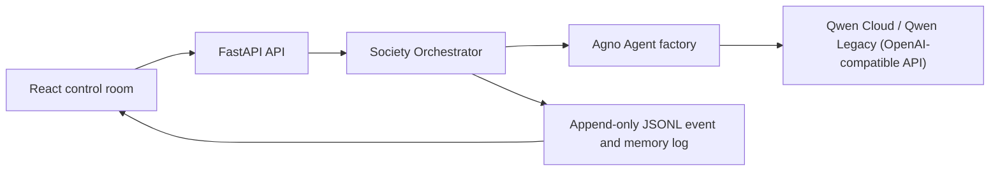

# Qwendom Agent Society

Qwendom is a Qwen Cloud hackathon prototype for an Agent Society: a visible group of agents with identities, skills, memory, temporary teams, elected leaders, negotiation, voting, peer monitoring, child-agent spawning, dissolution, and collaboration learning.

The backend uses FastAPI and the Agno SDK. The frontend is a small React control room for submitting a problem and watching the society solve it.

For the detailed runtime model, agent tools, collaboration patterns, persistence
layers, and validation flow, see [`docs/SOCIETY_RUNTIME.md`](docs/SOCIETY_RUNTIME.md).
For the Agno-native capability roadmap focused on useful tool access, artifact
generation, workflow routing, delegation, and validation, see
[`docs/AGNO_NATIVE_CAPABILITIES.md`](docs/AGNO_NATIVE_CAPABILITIES.md).
For the execution-ready implementation phases, file mappings, rollout guards,
and validation matrix, see [`docs/AGNO_ACTIVATION_PLAN.md`](docs/AGNO_ACTIVATION_PLAN.md).
For the planned conversation-first workflow where agents discuss the goal,
vote on readiness, elect a leader, and then receive subtasks, see
[`docs/PRE_EXECUTION_CONVERSATION_WORKFLOW.md`](docs/PRE_EXECUTION_CONVERSATION_WORKFLOW.md).
For the product-led implementation plan to make Qwendom mimic human work
behavior through stronger agent identities, dissent, trust, meeting formats,
and role-specific tools, see
[`docs/AGENT_UPGRADE_IMPLEMENTATION_PLAN.md`](docs/AGENT_UPGRADE_IMPLEMENTATION_PLAN.md).
For the remaining gaps between structured work behavior and natural human
conversation, see
[`docs/REMAINING_HUMAN_BEHAVIOR_GAPS.md`](docs/REMAINING_HUMAN_BEHAVIOR_GAPS.md).

## Why it fits the challenge

- Agents have persistent identities, skills, reputation, and memory.
- Every task creates a temporary team and elects a leader (LLM-powered when enabled, deterministic fallback otherwise).
- Agents produce competing proposals instead of blindly agreeing.
- The elected leader decides whether to spawn a child specialist (LLM-powered; prompt-length fallback otherwise).
- Each agent votes on proposals with a reason (LLM-powered; hash-based fallback otherwise).
- A reviewer agent provides a real critique of the selected solution (LLM-powered; summary fallback otherwise).
- Teams dissolve after completion.
- Agents update memory and reputation after collaboration.
- Qwen Cloud can power the Agno agents through the DashScope OpenAI-compatible endpoint.

## Run locally

```powershell
npm install
npm run install:all
npm run dev
```

Open `http://localhost:5173`.

The app works without secrets using deterministic fallback agents. To enable LLM-powered agents, copy `backend/.env.example` to `backend/.env` and configure a provider.

### Qwen Legacy (default)

```env
LLM_PROVIDER=qwen_legacy
QWEN_LEGACY_API_KEY=your_qwen_legacy_key
QWEN_LEGACY_MODEL=gemma-4-31b
```

### Qwen Cloud

```env
LLM_PROVIDER=qwen
QWEN_API_KEY=your_qwen_cloud_key
QWEN_BASE_URL=https://dashscope-intl.aliyuncs.com/compatible-mode/v1
QWEN_MODEL=qwen-plus
```

### Qwen Legacy

```env
LLM_PROVIDER=qwen_legacy
QWEN_LEGACY_API_KEY=your_qwen_legacy_key
QWEN_LEGACY_BASE_URL=https://qwen_legacy.ai/api/v1
QWEN_LEGACY_MODEL=qwen3.7-plus
```

Then restart the backend. The `/health` endpoint shows which provider is active and whether the LLM is enabled.

### Researcher Context7 MCP

The seeded `researcher` agent receives Context7 MCP tools on open-ended Agno
turns when LLM mode is enabled. This gives the researcher current library,
framework, SDK, CLI, and cloud-service documentation lookup without adding the
same tools to forced governance calls such as voting.

```env
ROLE_SPECIFIC_TOOLS_ENABLED=true
CONTEXT7_MCP_ENABLED=true
CONTEXT7_MCP_COMMAND=npx -y @upstash/context7-mcp
```

The default command uses `npx`, so Node.js must be available to the backend
process. Set `CONTEXT7_MCP_ENABLED=false` to disable the MCP server while
keeping the researcher identity active.

## API

```bash
curl -X POST http://localhost:8000/tasks \
  -H "Content-Type: application/json" \
  -d "{\"prompt\":\"Design a resilient plan for launching an AI tutoring product.\"}"
```

Useful endpoints:

- `GET /health`
- `GET /agents`
- `GET /teams`
- `GET /metrics`
- `POST /tasks`
- `GET /tasks/{task_id}`
- `GET /tasks/{task_id}/events`
- `GET /tasks/{task_id}/stream`

## Architecture



## Deployment notes for Alibaba Cloud

For the hackathon deployment, package the backend and frontend in a single ECS instance or container service:

1. Install Python 3.11+ and Node 20+.
2. Set `LLM_PROVIDER` (`qwen_legacy`, `qwen`, or `qwen_legacy`) and the corresponding keys: `QWEN_LEGACY_API_KEY`, `QWEN_LEGACY_MODEL` for Qwen Legacy; `QWEN_API_KEY`, `QWEN_BASE_URL`, `QWEN_MODEL` for Qwen Cloud; or `QWEN_LEGACY_API_KEY`, `QWEN_LEGACY_BASE_URL`, `QWEN_LEGACY_MODEL` for Qwen Legacy. Also set `FRONTEND_ORIGIN`.
3. Build the frontend with `cd frontend && npm install && npm run build`.
4. Run the backend with `cd backend && pip install -r requirements.txt && uvicorn main:app --host 0.0.0.0 --port 8000`.
5. Serve `frontend/dist` through Nginx and reverse-proxy `/api` or expose the backend separately.

For production persistence, replace the JSONL event store with Alibaba Cloud RDS, PolarDB, or TableStore. The store is isolated in `backend/society/memory.py` for that swap.
