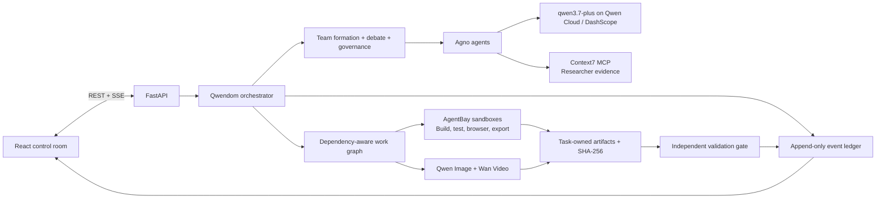

# Qwendom

**A Qwen-powered agent society that turns complex work into an inspectable process—not a black-box answer.**

Give Qwendom a mission and it assembles the right specialists, lets them challenge one another, assigns accountable work, executes through bounded tools, and independently validates the resulting artifacts. The React control room exposes the whole run: who proposed what, what evidence they used, where reviewers objected, what changed, which tools ran, and why the final answer passed.

The point is not to make several agents talk. It is to make their coordination earn its cost.

## What happens during a run

1. **Form the team.** Core roles establish the problem, then Qwendom selects fixed specialists by capability and records the reason for each assignment.
2. **Debate before execution.** Agents state positions, ask one another direct questions, register typed objections, revise weak proposals, vote on readiness, and elect a leader.
3. **Build with real tools.** The work graph respects dependencies and resource limits. Researchers can retrieve current technical evidence through Context7 MCP; builders and test engineers can work in isolated AgentBay sandboxes; media specialists can produce Qwen image and Wan video artifacts.
4. **Preserve the evidence.** Tool intent, results, decisions, artifacts, hashes, failures, revisions, and cleanup are written to the event ledger and projected into the UI in real time.
5. **Validate independently.** A specialist separate from the producer inspects exported artifacts and acceptance evidence before the orchestration layer can declare success.

## Architecture



Qwendom uses Agno for Qwen-backed agent execution and memory, but keeps orchestration policy in its own typed runtime. That separation matters: model output cannot silently grant tools, bypass a blocker, invent an artifact, or mark its own work valid. The repository owns role capabilities, tool grants, work-graph limits, event schemas, and completion gates.

### Models, tools, and MCP

| Capability | Runtime path | What is recorded |
|---|---|---|
| Reasoning and coordination | `qwen3.7-plus` through Agno's native DashScope model | Agent turns, proposals, challenges, votes, revisions, and final synthesis |
| Technical research | Role-scoped Context7 MCP for the Researcher | Tool intent, retrieved evidence, provenance, failures, and evidence gaps |
| Code and browser execution | Bounded AgentBay sessions for execution specialists | Session lifecycle, commands, code runs, file operations, browser renders, exports, and cleanup |
| Image generation | `qwen-image-2.0-pro-2026-06-22` | Generation job, collected image, inspection, provenance, and published artifact |
| Video generation | `wan2.7-t2v-2026-06-12` | Submission, job state, collection, inspection, and published artifact |

### Builder sandbox through AgentBay

The Builder does not write directly into the host repository. Qwendom creates a task-scoped AgentBay environment, stages only the approved workspace inputs, and grants an explicit tool surface: start the environment, execute commands or code, read and write files, render in a browser when required, export artifacts, and close the session.

Exports become task-owned artifacts only after Qwendom retrieves the bytes, records provenance and a SHA-256 digest, and exposes them through the task artifact API. Sandbox closure is part of the acceptance evidence, not background housekeeping. A run cannot present unfinished cleanup or an unvalidated export as a clean success.

## Qwendom vs. one Qwen agent

The Version 3 demo gives both modes the same composite security-release audit, the same `qwen3.7-plus` model, byte-identical task text, the same four read-only evidence surfaces, the same optional lookup and calculation tools, and the same deterministic 24-check evaluator. Discussion earns no points; only the final answer is scored.

Across the three illustrated trials, **Qwendom passes every acceptance check: 72/72, compared with 60/72 for the single-agent baseline.** That is a **16.67-point quality gain** on the scenario—`100.00` versus `83.33`—with the review and decision trail preserved behind the answer.

| Result | Single agent | Qwendom society |
|---|---:|---:|
| Successful trials | 3/3 | 3/3 |
| Failed attempts | 0 | 0 |
| Mean quality | 83.33 | **100.00** |
| Acceptance checks | 60/72 | **72/72** |
| Mean time per trial | **18.40 s** | 74.25 s |
| Qwen calls | **3** | 18 |
| Tokens | **12,480** | 98,760 |
| Recorded evidence-tool calls | 12 | 24 |
| Checks per minute | **108.70** | 19.39 |
| Checks per million tokens | **4,807.69** | 729.05 |

The trade-off is explicit: the society spends more time, calls, and tokens to close the displayed quality gap. These are **illustrative demo scenario inputs, not measured provider runs or a claim that multi-agent execution wins every task**. The result demonstrates the product thesis under one controlled audit: use a society when accountable review and completeness matter more than minimum inference cost.

## Run locally

Prerequisites: Python 3.11+, Node.js 20+, npm, and a Qwen Cloud API key. Context7 research also requires `npx`.

```powershell
npm install
npm run install:all
npm run dev
```

Open `http://localhost:5173`, then copy `backend/.env.example` to `backend/.env` and configure the production path:

```env
LLM_PROVIDER=qwen
QWEN_API_KEY=your_qwen_cloud_key
QWEN_BASE_URL=https://dashscope-intl.aliyuncs.com/compatible-mode/v1
QWEN_MODEL=qwen3.7-plus

ROLE_SPECIFIC_TOOLS_ENABLED=true
CONTEXT7_MCP_ENABLED=true
CONTEXT7_MCP_COMMAND=npx -y @upstash/context7-mcp

TEAM_COMPOSITION_EXECUTION_ENABLED=true
AGENTBAY_API_KEY=your_agentbay_key
AGENTBAY_ENDPOINT=wuyingai.ap-southeast-1.aliyuncs.com
AGENTBAY_REGION_ID=ap-southeast-1
```

The production path fails honestly when model or execution credentials are unavailable. `GET /health` reports model and provider readiness. `ALLOW_DETERMINISTIC_NO_KEY=true` exists only for explicitly labelled local lifecycle tests; those runs are not Qwen or benchmark evidence.

Useful endpoints:

- `POST /tasks` — submit a mission
- `GET /tasks/{task_id}` — read current task state
- `GET /tasks/{task_id}/events` — inspect the event ledger
- `GET /tasks/{task_id}/stream` — follow the run over SSE
- `GET /tasks/{task_id}/artifacts` — list task-owned outputs
- `GET /health` — inspect runtime and provider readiness

## Alibaba Cloud deployment

Qwendom ships as one production container: FastAPI serves the API, compiled React application, and hash-verified artifacts from the same origin. The deployment target is Alibaba Cloud ACR plus ECS in Singapore, with outbound HTTPS to DashScope, AgentBay, and the optional Context7 MCP process. Persistent storage mounted at `/app/backend/society/data` keeps the event ledger and exported composition artifacts across restarts.

```bash
docker build -t qwendom:judge .
docker run --rm --env-file backend/.env \
  -e FRONTEND_ORIGIN=http://localhost:8000 \
  -e TEAM_COMPOSITION_EXECUTION_ENABLED=true \
  -p 8000:8000 qwendom:judge
curl --fail http://localhost:8000/health
```

For a deployment to count as verified, the public service must pass the same evidence chain: healthy Qwen and AgentBay preflight, a real mission streamed end to end, visible sandbox closure, downloadable artifacts whose response hash matches the ledger, independent validation, and persistence after a container restart.

## Why Qwendom

A single agent gives you an answer. Qwendom gives you the answer **and the working record required to trust it**: the team, the argument, the evidence, the execution, the artifact, the review, and the final gate.
