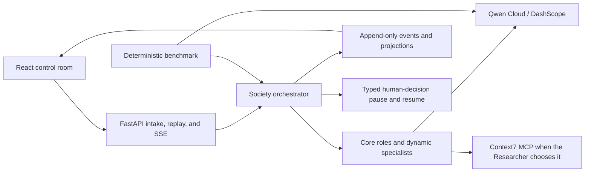

# Qwendom Agent Society

Qwendom makes multi-agent work inspectable: a Qwen-powered society decomposes a task, assigns accountable roles, records disagreement and votes, and preserves the evidence behind its answer.

The backend uses FastAPI and the Agno SDK. The frontend is a small React control room for submitting a problem and watching the society solve it.

For the detailed runtime model, agent tools, collaboration patterns, persistence
layers, and validation flow, see [`docs/SOCIETY_RUNTIME.md`](docs/SOCIETY_RUNTIME.md).

## Why it fits the challenge

- Agents have persistent identities, skills, reputation, and memory.
- Every task creates a temporary team and elects a leader (LLM-powered when enabled, deterministic fallback otherwise).
- Agents produce competing proposals instead of blindly agreeing.
- The elected leader decides whether to spawn a child specialist (LLM-powered; prompt-length fallback otherwise).
- Each agent votes on proposals with a reason (LLM-powered; hash-based fallback otherwise).
- A reviewer agent provides a real critique of the selected solution (LLM-powered; summary fallback otherwise).
- Teams dissolve after completion.
- Agents update memory and reputation after collaboration.
- Qwen Cloud can power the Agno agents through the DashScope OpenAI-compatible endpoint.

## Run locally

Prerequisites: Python 3.11 or newer, Node.js 20 or newer, npm, and a Qwen
Cloud API key for the submission path. Context7 research also requires `npx`.

```powershell
npm install
npm run install:all
npm run dev
```

Open `http://localhost:5173`.

Copy `backend/.env.example` to `backend/.env` and configure Qwen Cloud. The production path fails honestly when no model credential is available; it does not manufacture a deterministic society result.

For intentionally model-free local lifecycle testing only, set
`ALLOW_DETERMINISTIC_NO_KEY=true`. Runs from that mode are visibly
deterministic and must never be used as Qwen or benchmark evidence.

### Qwen Legacy (default)

```env
LLM_PROVIDER=qwen_legacy
QWEN_LEGACY_API_KEY=your_qwen_legacy_key
QWEN_LEGACY_MODEL=gemma-4-31b
```

### Qwen Cloud

```env
LLM_PROVIDER=qwen
QWEN_API_KEY=your_qwen_cloud_key
QWEN_BASE_URL=https://dashscope-intl.aliyuncs.com/compatible-mode/v1
QWEN_MODEL=qwen3.7-plus
```

### Qwen Legacy

```env
LLM_PROVIDER=qwen_legacy
QWEN_LEGACY_API_KEY=your_qwen_legacy_key
QWEN_LEGACY_BASE_URL=https://qwen_legacy.ai/api/v1
QWEN_LEGACY_MODEL=qwen3.7-plus
```

Then restart the backend. The `/health` endpoint shows which provider is active and whether the LLM is enabled.

### Researcher Context7 MCP

The seeded `researcher` agent receives Context7 MCP tools on open-ended Agno
turns when LLM mode is enabled. This gives the researcher current library,
framework, SDK, CLI, and cloud-service documentation lookup without adding the
same tools to forced governance calls such as voting.

```env
ROLE_SPECIFIC_TOOLS_ENABLED=true
CONTEXT7_MCP_ENABLED=true
CONTEXT7_MCP_COMMAND=npx -y @upstash/context7-mcp
```

The default command uses `npx`, so Node.js must be available to the backend
process. Set `CONTEXT7_MCP_ENABLED=false` to disable the MCP server while
keeping the researcher identity active.

## API

```bash
curl -X POST http://localhost:8000/tasks \
  -H "Content-Type: application/json" \
  -d "{\"prompt\":\"Design a resilient plan for launching an AI tutoring product.\"}"
```

Useful endpoints:

- `GET /health`
- `GET /agents`
- `GET /teams`
- `GET /metrics`
- `POST /tasks`
- `GET /tasks/{task_id}`
- `GET /tasks/{task_id}/events`
- `GET /tasks/{task_id}/stream`

## Architecture

The judge-readable explanation is in
[`docs/HACKATHON_ARCHITECTURE.md`](docs/HACKATHON_ARCHITECTURE.md).



Submission packaging drafts are available in
[`docs/DEMO_SCRIPT.md`](docs/DEMO_SCRIPT.md) and
[`docs/DEVPOST_SUBMISSION.md`](docs/DEVPOST_SUBMISSION.md). External demo,
video, team, and deployment fields remain explicitly pending.

The third-party inventory is in
[`docs/THIRD_PARTY_NOTICES.md`](docs/THIRD_PARTY_NOTICES.md).

## Reproducible benchmark

The frozen v3 benchmark gives `qwen3.7-plus` the same tool-enriched security
release audit in single-agent and society modes. Both receive the same prompt,
four prefetched read-only evidence surfaces, optional lookup/calculation tools,
budgets, and deterministic 24-check evaluator. Across three successful trials
per mode, both scored **100.00**. Society used **53 calls / 810,389 tokens /
233.17 seconds per trial** versus **3 calls / 8,310 tokens / 11.71 seconds** for
the single agent. The honest result is equal quality while society is about
19.9 times slower and uses about 97.5 times more tokens—not an efficiency win.

See [`docs/BENCHMARK.md`](docs/BENCHMARK.md) for methodology, results, and exact
reproduction commands.

```powershell
cd backend
python -m benchmarks.run_benchmark --successful-trials 3 --max-attempts 5
# Fair multi-ask suite v2:
python -m benchmarks.run_benchmark_v2 --successful-trials 3 --max-attempts 4 --task-concurrency 4
# Frozen tool-enriched suite v3:
python -m benchmarks.run_benchmark_v3 --successful-trials 3 --max-attempts 5 --mode both
```

## Hosted code execution decision

Qwen3.7-Plus supports Qwen Cloud Code Interpreter. It is useful as an optional,
separate compute capability, but it is not described here as a replacement for
an orchestrator-controlled sandbox: it cannot share a request with function
calling and does not expose the workspace/artifact lifecycle needed for
independent validation. Custom sandboxing remains out of the current scope.

## Deployment notes for Alibaba Cloud

The repository now includes a multi-stage [`Dockerfile`](Dockerfile) that serves
the API, production React bundle, and hash-verified artifacts from one origin.
Use [`docs/ALIBABA_CLOUD_DEPLOYMENT.md`](docs/ALIBABA_CLOUD_DEPLOYMENT.md) for
the ACR/ECS deployment path, required secrets, persistent volume, health probe,
and jury acceptance checks. Deployment notes are not a deployment claim: a
public Alibaba URL and restart-persistence check are still required evidence.

## Troubleshooting

- **`uvicorn` is not found:** run the backend as
  `python -m uvicorn main:app --reload --port 8000` from `backend`.
- **Frontend cannot reach the API:** confirm `VITE_API_BASE` points to the
  backend actually running on port 8000, then restart Vite.
- **`/health` reports model preflight not ready:** confirm `LLM_PROVIDER=qwen`,
  `QWEN_MODEL=qwen3.7-plus`, and an unquoted non-empty `QWEN_API_KEY` in the
  backend environment. Never put the key in a frontend variable.
- **Context7 fails to start:** verify `npx -y @upstash/context7-mcp` works, or
  set `CONTEXT7_MCP_ENABLED=false`; the Researcher must report the evidence gap
  rather than inventing citations.
- **Windows listener stops accepting connections:** the observed
  `IocpProactor.accept` / `WinError 64` failure is Windows-specific. For local
  judge QA, launch Uvicorn under `WindowsSelectorEventLoopPolicy`; this workaround
  is not required on the intended Linux deployment.
- **A run says `complete_with_warnings`:** required acceptance evidence passed,
  but optional proof or a non-blocking risk remains. Review Recap before treating
  it as equivalent to a clean `complete` result.

Before public submission, run `python scripts/check_release_readiness.py`. It
fails closed while the license, final benchmark, public links, or repository
hygiene gates remain unresolved.
