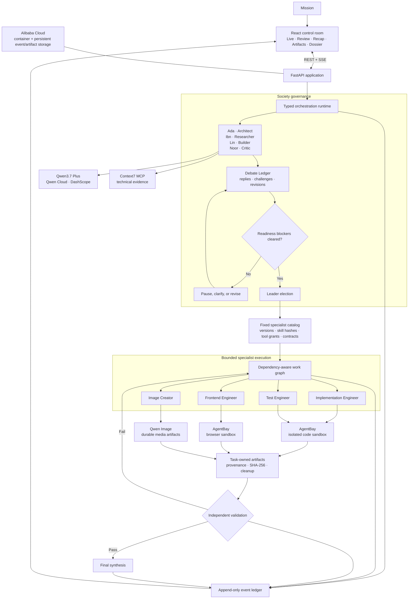

# Qwendom

**Qwendom means Qwen Kingdom: a Qwen-powered agent society that can argue, build, fail, revise, and prove why its work is ready.**

Most agent systems hide the work behind one answer. Qwendom exposes it. A mission enters a shared room where four governing agents debate the approach, register blockers, elect a leader, and assign bounded execution to fixed specialists. Builders work in AgentBay sandboxes, reviewers can stop the run, artifacts carry hashes and provenance, and completion requires independent evidence.

The result is not four chatbots answering in parallel. It is one inspectable chain of responsibility from first claim to final artifact.

## What happens during a mission

1. **The society frames the problem.** Ada, Ibn, Lin, and Noor establish scope, surface assumptions, and reply to one another in the Debate Ledger.
2. **Blockers have force.** A typed critical objection can stop readiness. The system records the reason instead of polishing over it.
3. **The team elects a leader.** Leadership is task-specific and visible in the event history.
4. **The leader selects fixed specialists.** The leader may choose only repository-defined employees with versioned skills, immutable tool bundles, resource limits, and artifact contracts.
5. **Specialists execute.** Code, tests, and browser work run inside task-scoped AgentBay environments. Research uses Context7 MCP. Image artifacts use Qwen Image.
6. **Failure causes another iteration.** A failed test, rejected browser render, missing export, or unresolved blocker routes the work back for revision.
7. **A different specialist validates.** Producers cannot approve their own artifacts. Qwendom completes only when the evidence, exported artifact, and independent verdict agree.

## Architecture



Agno runs the Qwen-backed agents, while Qwendom owns the policy around them. Model output cannot invent a specialist, grant itself a tool, erase a blocker, fabricate an artifact, or mark its own work independently verified.

## The society and its specialists

The four named agents govern the mission. They deliberate, vote, and decide whether work is ready to execute.

| Agent | Responsibility | Representative tools |
|---|---|---|
| **Ada · Systems Architect** | Boundaries, decomposition, interfaces, ownership | `decompose_task`, `risk_assessment`, repository and dependency inspection |
| **Ibn · Research Analyst** | Evidence, assumptions, current technical context | `context7_lookup`, approved evidence and citation lookup |
| **Lin · Builder** | Implementation planning and delivery feasibility | implementation planning, repository inspection, execution planning |
| **Noor · Adversarial Reviewer** | Counterarguments, risk, acceptance gates | `risk_assessment`, artifact and report review, rubric checks |

Execution is a separate layer. After readiness and leader election, Qwendom materializes only the specialists required by the work graph.

| Fixed specialist | Versioned skill | Granted tool surface | Artifact rule |
|---|---|---|---|
| **Implementation Engineer** | `repository_implementation@2` | Start/close AgentBay, execute commands or code, read/write/list files, export artifacts | Produces code; cannot validate it; independent review required |
| **Test Engineer** | `independent_validation@1` | Start/close AgentBay, execute checks, read/list files, inspect artifacts, report validation | Validates from exported evidence; cannot change product files |
| **Image Creator** | `image_generation@1` | `generate_images`, `inspect_image`, `publish_image` | Produces durable images; cannot accept its own output |
| **Frontend Engineer** | `frontend_browser_delivery@1` | AgentBay file/command tools, one browser render, artifact export, cleanup | Produces UI and browser evidence; independent review required |

Each skill file is pinned by SHA-256. The runtime verifies the skill content and computes a hash for the resolved tool bundle before execution. The leader selects and sequences employees; it does not author their permissions.

### AgentBay is the execution boundary

Qwendom does not hand a Builder unrestricted host access. It opens a task-scoped AgentBay environment, stages approved inputs, grants the specialist's exact tools, records commands and results, retrieves explicit outputs, hashes exported bytes, and closes the environment.

A path written inside a sandbox is not automatically a product artifact. It becomes task-owned only after export, provenance capture, SHA-256 verification, and independent validation. Missing cleanup or a failed check remains a visible blocker.

## Benchmark: iteration beats premature confidence

The special three-trial comparison gives the single-agent baseline and Qwendom the same security-release mission, evidence packet, Qwen model, and deterministic evaluator. The difference is the operating model: one agent produces an answer, while Qwendom can debate, delegate, block, revise, and rerun validation.

| Result across three trials | Single Qwen agent | Qwendom society |
|---|---:|---:|
| Mean quality | 42 | **100** |
| Acceptance checks passed | 47/72 | **72/72** |
| Total Qwen calls | 14 | 124 |
| Total tokens | 921K | 3.9M |

Qwendom wins this benchmark because it is allowed to keep working. Specialists challenge unsupported claims, blockers prevent premature completion, builders answer failed checks with revisions, and an independent specialist reruns the acceptance path. That costs more calls and tokens. In this benchmark, the extra iteration buys a complete result: `100` quality and every acceptance check passed.

This is a specific result, not a claim that a society is cheaper or better for every prompt. Qwendom is designed for work where a missed requirement costs more than another review cycle. See [the benchmark methodology](docs/BENCHMARK.md).

## Models, tools, and infrastructure

| Capability | Implementation |
|---|---|
| Agent reasoning and synthesis | `qwen3.7-plus` through Qwen Cloud / DashScope; `qwen3.7-max` is also accepted by provider preflight |
| Agent runtime | Agno agents with structured outputs and bounded retries |
| Current technical research | Context7 MCP with recorded intent and provenance |
| Code, test, and browser execution | AgentBay task-scoped sandboxes |
| Image generation | `qwen-image-2.0-pro-2026-06-22` |
| Video provider integration | `wan2.7-t2v-2026-06-12` submission, status, collection, and inspection tools |
| Application | FastAPI, React, REST, and SSE |
| Hosting | Alibaba Cloud container deployment with persistent event and artifact storage |

## Run locally

Prerequisites: Python 3.11+, Node.js 20+, npm, Qwen Cloud credentials, and AgentBay credentials for execution missions. Context7 research also requires `npx`.

```powershell
npm install
npm run install:all
Copy-Item backend/.env.example backend/.env
npm run dev
```

Set at least these production-path values in `backend/.env`:

```env
LLM_PROVIDER=qwen
QWEN_API_KEY=your_qwen_cloud_key
QWEN_MODEL=qwen3.7-plus

AGENTBAY_API_KEY=your_agentbay_key
AGENTBAY_ENDPOINT=wuyingai.ap-southeast-1.aliyuncs.com
AGENTBAY_REGION_ID=ap-southeast-1
TEAM_COMPOSITION_EXECUTION_ENABLED=true
```

Open `http://localhost:5173`. The API runs on `http://localhost:8000`.

The production path fails honestly when Qwen or AgentBay is unavailable. `GET /health` and `GET /health/preflight` expose provider readiness. `ALLOW_DETERMINISTIC_NO_KEY=true` is reserved for explicitly labelled local lifecycle tests; it is not Qwen, AgentBay, or benchmark evidence.

## API and evidence surfaces

- `POST /tasks` — submit a mission
- `POST /tasks/{task_id}/clarifications` — resume a blocked mission with user input
- `GET /tasks/{task_id}/stream` — follow the event ledger over SSE
- `GET /tasks/{task_id}/review` — inspect ownership, blockers, and validation
- `GET /tasks/{task_id}/recap` — reconstruct the decision path
- `GET /tasks/{task_id}/artifacts` — list verified task-owned outputs
- `GET /agents/{agent_id}/dossier?task_id=...` — inspect one participant's record
- `GET /health` — inspect Qwen and execution readiness

## Deployment and deeper documentation

Qwendom is packaged as one production container: FastAPI serves the API, compiled React application, and verified artifacts from the same origin. The deployment uses Alibaba Cloud infrastructure with outbound access to DashScope and AgentBay.

- [Architecture and trust boundaries](docs/HACKATHON_ARCHITECTURE.md)
- [Society runtime](docs/SOCIETY_RUNTIME.md)
- [Benchmark methodology](docs/BENCHMARK.md)
- [Alibaba Cloud deployment](docs/ALIBABA_CLOUD_DEPLOYMENT.md)
- [Third-party notices](docs/THIRD_PARTY_NOTICES.md)

## Why Qwendom

A single agent gives you an answer. Qwendom gives you the answer, the disagreement that improved it, the sandbox that produced it, the blocker that prevented a bad release, and the evidence that finally cleared the work.
