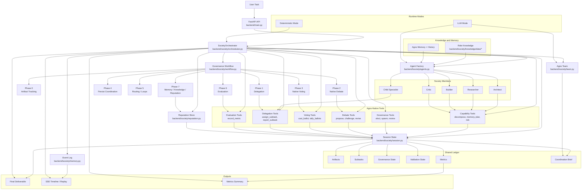

# Agno Activation Plan

This document turns [AGNO_NATIVE_CAPABILITIES.md](./AGNO_NATIVE_CAPABILITIES.md)
into an executable implementation plan for the current Qwendom codebase.

It is intentionally concrete:

- it names the current files and methods to change,
- it sequences work into bounded phases,
- it defines acceptance criteria for each phase,
- it preserves the current event contract and deterministic mode, and
- it calls out rollback points and feature-flag needs up front.

## Objective

Make the Qwendom society actually useful by activating Agno-native execution
paths for:

- artifact generation,
- delegation,
- native debate and voting tools,
- validation loops,
- memory and knowledge improvement,
- adaptive workflow routing.

The success condition is not "more social behavior." The success condition is:

1. the society can produce typed intermediate artifacts,
2. those artifacts can be validated and revised,
3. the team can delegate bounded work to members and child agents,
4. the final answer can be traced back to completed work products, and
5. the existing frontend timeline and deterministic no-key mode continue to
   work.

## Target System Diagram



## Non-Goals

This plan does not aim to:

- redesign the frontend,
- replace the event log or Agno DB persistence model immediately,
- add production-grade distributed execution,
- remove the current orchestrator in one step,
- introduce broad new task-domain tools before the artifact/delegation spine is
  stable.

## Current Implementation Baseline

The current runtime is centered on these files:

- `backend/society/orchestrator.py`
- `backend/society/session.py`
- `backend/society/workflow.py`
- `backend/society/team.py`
- `backend/society/agents.py`
- `backend/society/tools/*.py`

The important active methods today are:

- `_run_agno_team()`
- `_spawn_child_agent()`
- `_do_spawn()`
- `_negotiate()`
- `_run_debate_revision_round()`
- `_vote()`
- `_monitor()`
- `_learn()`
- `_compose_answer()`

The important dormant or partially dormant Agno-native tool modules are:

- `backend/society/tools/debate.py`
- `backend/society/tools/voting.py`
- `backend/society/tools/delegation.py`
- `backend/society/tools/evaluation.py`

## Guardrails

These rules apply to every phase:

1. Preserve the current event contract.
2. Preserve deterministic no-key mode.
3. Make session state changes additive before making them authoritative.
4. Add feature flags for any new active execution path that can replace a
   current legacy path.
5. Do not widen scope into new task-domain tools until artifact/delegation
   mechanics are stable.

## Event Contract To Preserve

The following currently emitted events must remain stable through migration:

- `task_received`
- `team_formed`
- `workflow_checkpoint`
- `workflow_completed`
- `agno_team_ran`
- `leader_elected`
- `child_agent_spawned`
- `no_spawn`
- `agent_negotiated`
- `proposal_challenged`
- `proposal_revised`
- `debate_round_completed`
- `negotiation_closed`
- `vote_cast`
- `ballots_tallied`
- `solution_selected`
- `peer_monitor_report`
- `learning_recorded`
- `reputation_updated`
- `team_dissolved`
- `task_failed`
- `task_metrics`
- `task_complete`

The orchestrator remains the compatibility layer responsible for mapping any
more-native Agno behavior back onto these events.

## Feature Flags To Introduce Early

Before activating new paths, add explicit switches for:

- `artifact_tracking_enabled`
- `delegation_tools_enabled`
- `native_debate_enabled`
- `native_voting_enabled`
- `workflow_routing_enabled`
- `evaluation_metrics_enabled`

These can live in config or as orchestrator-local toggles during early
implementation. The point is rollback, not elegance.

Implementation decision:

- define them in `backend/config.py` as boolean settings sourced from env vars,
- default them all to `false`,
- treat them as global runtime flags for the first rollout,
- read them through `Settings` and branch inside the orchestrator.

Initial env forms:

- `ARTIFACT_TRACKING_ENABLED=false`
- `DELEGATION_TOOLS_ENABLED=false`
- `NATIVE_DEBATE_ENABLED=false`
- `NATIVE_VOTING_ENABLED=false`
- `WORKFLOW_ROUTING_ENABLED=false`
- `EVALUATION_METRICS_ENABLED=false`

## Phase 0: Artifact Tracking In Session State

### Goal

Introduce typed artifact tracking without changing the current visible task
behavior.

### Files

- `backend/society/session.py`
- `backend/society/orchestrator.py`
- `backend/society/schemas/artifacts.py` (new)
- optionally `backend/society/schemas/validation.py` (new, if acceptance checks
  are modeled immediately)

### Changes

1. Extend `initial_session_state()` with additive fields:

```json
{
  "artifacts": [],
  "artifact_index": {},
  "acceptance_checks": [],
  "failed_checks": [],
  "final_deliverable": null
}
```

2. Define artifact schemas in `backend/society/schemas/artifacts.py`.

Minimum schema set:

- `ArtifactRecord`
- `ArtifactReference`
- `FinalDeliverable`

Normative `ArtifactRecord` shape:

- `id: str`
- `type: str`
- `producer: str`
- `phase: str`
- `content: dict[str, Any]`
- `depends_on: list[str]`
- `confidence: float | None`
- `status: Literal["draft", "final", "failed"]`
- `created_at: str`

Storage rule:

- `artifacts` is the append-only ordered ledger,
- `artifact_index` is a derived id-to-record map rebuilt from `artifacts`,
- `artifact_index` is a cache, not an independent source of truth.

3. Update `orchestrator.py` to register artifacts in parallel with existing
   fields:

- proposals created in `_negotiate()`
- revisions created in `_run_debate_revision_round()`
- critique created in `_monitor()`
- final answer created in `_compose_answer()` or immediately after it

4. Keep legacy state fields intact:

- `proposals`
- `challenges`
- `revisions`
- `ballots`
- `tally`
- `critique`

### Acceptance Criteria

- task runs do not break in deterministic or LLM mode,
- session state contains additive artifact records,
- final output can reference artifact ids or summaries,
- no frontend changes are required to render the existing SSE timeline.

### Validation

- submit at least one deterministic task,
- submit at least one LLM-backed task,
- verify artifact fields exist in session state and do not replace legacy fields.

## Phase 1: Activate Delegation Tools

### Goal

Make spawned specialists and leaders perform bounded delegated work rather than
only join the debate/vote path.

### Files

- `backend/society/orchestrator.py`
- `backend/society/tools/delegation.py`
- `backend/society/session.py`

### Changes

1. Add a clear subtask lifecycle.

Recommended statuses:

- `planned`
- `assigned`
- `completed`
- `blocked`

2. Reconcile the existing dual writers:

- `capabilities.py:decompose_task_tool()` currently writes `planned` subtasks,
- `delegation.py:assign_subtask_tool()` writes `assigned` subtasks.

Define one source of truth:

- `decompose_task_tool()` is the only writer that creates `planned` subtasks,
- `assign_subtask_tool()` is the only writer that transitions a planned subtask
  to `assigned`,
- `report_subtask_tool()` is the only writer that transitions an assigned
  subtask to `completed` or `blocked`.

Migration rule:

- when `assign_subtask_tool()` runs, it should update an existing planned
  subtask when one exists,
- it should only append a new assigned subtask when there is no planned record
  to transition,
- duplicate logical subtasks should be treated as a bug and surfaced during
  validation,
- subtask reporting must identify a specific subtask record, not only an
  `agent_id`, before this phase is considered complete.

3. Add a delegation phase in `orchestrator.py` after child spawn and before
   negotiation.

Recommended new method:

- `_delegate_subtasks(self, task: TaskRun, team: Team) -> None`

4. Wire `assign_subtask_tool` into:

- leader delegation,
- child-agent work assignment,
- optionally high-confidence member assignments.

5. Wire `report_subtask_tool` into:

- child-agent completion,
- member status reporting when a delegated unit of work exists.

6. Update `_compose_answer()` to include:

- completed subtasks,
- unresolved blockers,
- which delegated outputs influenced the final answer.

### Acceptance Criteria

- leaders can assign at least one subtask,
- child agents can report completed or blocked work,
- final synthesis includes delegated work outputs,
- no existing events are removed.

### Validation

- one LLM-backed task that spawns a child agent,
- one deterministic fallback task that still produces the same subtask shape,
- inspect event stream to confirm existing task flow still completes.

## Phase 2: Activate Debate Tools As Active Path

### Goal

Replace hand-rolled proposal/challenge/revision construction with native
Agno tool calls while keeping the same visible behavior.

### Files

- `backend/society/orchestrator.py`
- `backend/society/tools/debate.py`

### Changes

1. Replace direct proposal construction in `_negotiate()` with `propose_tool`
   runs.
2. Replace direct challenge construction in `_run_debate_revision_round()` with
   `challenge_tool`.
3. Replace direct revision construction in `_run_debate_revision_round()` with
   `revise_tool`.
4. Keep orchestrator event emission as the compatibility layer:

- `agent_negotiated`
- `proposal_challenged`
- `proposal_revised`
- `debate_round_completed`
- `negotiation_closed`

5. Introduce a feature flag:

- if `native_debate_enabled` is off, use the current legacy path.

### Important Constraint

`debate.py` tools require a real `RunContext` and use
`stop_after_tool_call=True`. That means this phase likely requires
one-tool-per-run orchestration rather than a single multi-tool agent pass.

Implementation decision:

- do one Agno run per proposal,
- do one Agno run per challenge,
- do one Agno run per revision,
- let the orchestrator sequence those runs explicitly through shared session
  state.

Do not remove `stop_after_tool_call=True` in this phase. First prove parity
with explicit one-tool-per-run orchestration.

Parity rule:

- native challenge records must preserve the fields downstream code already
  expects from the legacy path, including debate-round information.

### Acceptance Criteria

- debate state is written by tools rather than hand-built dicts,
- event emission remains unchanged at the frontend contract level,
- fallback path remains available behind the flag.

### Validation

- compare one legacy and one native-debate task run,
- confirm session state has equivalent proposals/challenges/revisions,
- confirm event stream remains readable and complete.

## Phase 3: Activate Voting Tools As Active Path

### Goal

Move ballot casting and tallying into native voting tools.

### Files

- `backend/society/orchestrator.py`
- `backend/society/tools/voting.py`
- `backend/society/tools/governance.py`

### Changes

1. Replace the current `_vote()` internals with:

- `cast_ballot_tool` per voter,
- `tally_ballots_tool` once all ballots are present.

2. Keep the legacy `governance.cast_vote` path available behind a feature flag
   until parity is proven.

3. Preserve the existing voting events:

- `vote_cast`
- `ballots_tallied`
- `solution_selected`

4. Resolve the `VoteDecision` compatibility question explicitly:

- either keep schema compatibility by mapping ballot results back into the same
  payload shape,
- or version the payload change intentionally.

### Important Constraint

`stop_after_tool_call=True` means ballot casting and tallying will also be
multi-run orchestration, not a single chained tool call.

Implementation decision:

- do one Agno run per ballot,
- do one final Agno run for tally,
- only call tally after the orchestrator confirms the expected voter count has
  been reached.

### Acceptance Criteria

- all ballots are written through native tools,
- tally and winner are written through native tools,
- visible events and replay behavior remain stable,
- rollback to legacy vote flow is still possible.

### Validation

- one task run on legacy voting,
- one task run on native voting,
- verify same winner/tally semantics at the application layer.

## Phase 4: Persist Team Coordination Output

### Goal

Make the Agno team coordination pass feed real downstream work instead of
emitting a disposable brief.

### Files

- `backend/society/orchestrator.py`
- `backend/society/team.py`
- `backend/society/session.py`

### Changes

1. Update `_run_agno_team()` to store coordination output in session state.

Suggested field:

- `team_coordination_brief`

Normative shape:

```json
{
  "summary": "...",
  "proposed_subtasks": [],
  "open_questions": [],
  "recommended_focus": "",
  "confidence": null
}
```

2. Use that output in:

- `_delegate_subtasks()`
- `_negotiate()`
- optionally `_spawn_child_agent()`

3. Keep `agno_team_ran` event emission, but treat its payload as a visible
   snapshot of persisted state rather than a one-off string.

### Acceptance Criteria

- coordination output survives beyond the event payload,
- later phases can consume it,
- deterministic mode still skips team run cleanly without breaking state shape.

### Validation

- one LLM-backed run confirms session state now includes coordination output,
- one deterministic run confirms the field is absent or null without causing
  failures.

## Phase 5: Workflow Routing, Conditions, and Loops

### Goal

Move from a fixed lifecycle spine to a controlled adaptive workflow.

### Files

- `backend/society/workflow.py`
- `backend/society/orchestrator.py`

### Changes

1. Verify the installed Agno version supports the intended workflow primitives
   before implementation.

Version-gate rule:

- Phase 5 is blocked until the installed Agno package is verified to expose the
  required workflow primitives for this repo,
- if those primitives are not available, keep the current linear workflow spine
  and emulate routing/conditions in the orchestrator as the fallback plan.
2. Start with explicit task classes:

- research-dominant,
- planning-dominant,
- implementation-dominant,
- review-dominant.

3. Introduce `Router` only after the classification rule is simple and stable.
4. Introduce `Condition` for low-risk skips such as:

- skip extra debate when only one proposal exists,
- skip additional validation when no failed checks exist.

5. Introduce `Loop` for bounded revision/validation cycles with an explicit
   iteration budget.

### Failure Semantics

- if loop budget is exceeded, emit a degraded completion or bounded failure,
  not a silent continuation,
- if routing fails, fall back to the default linear spine.

### Acceptance Criteria

- workflow remains understandable in replay,
- adaptive paths are bounded and debuggable,
- deterministic fallback remains possible.

### Validation

- test at least one task per initial task class,
- test one looped validation/revision scenario,
- test one fallback-to-linear scenario.

## Phase 6: Activate Evaluation Tool For Artifact Quality

### Goal

Record artifact quality and validation outcomes as first-class metrics.

### Files

- `backend/society/tools/evaluation.py`
- `backend/society/workflow.py`
- `backend/society/orchestrator.py`

### Changes

1. Wire `record_metric_tool` into:

- validation phases,
- monitoring output,
- final deliverable assessment.

2. Define concrete metric families:

- artifact completeness,
- validation pass/fail,
- confidence,
- blocker severity,
- revision count.

Minimum typing rules:

- completeness: `float` in `0.0..1.0`
- validation pass/fail: `bool` or normalized `0.0/1.0`
- confidence: `float` in `0.0..1.0`
- blocker severity: `int` in `0..3`
- revision count: `int >= 0`

3. Update `compute_task_metrics()` so it can incorporate both:

- system-derived runtime metrics,
- agent-recorded evaluation metrics.

Metric accounting rule:

- choose exactly one layer to increment `metrics["tool_calls"]` for activated
  native tools,
- either tool modules stop incrementing the counter directly, or orchestrator
  emission stops doing so for those paths,
- double-counting must be treated as a failed rollout.

### Acceptance Criteria

- evaluation metrics exist in session state,
- final metrics reflect both system and agent-side evaluation,
- replay can inspect these metrics after restart.

### Validation

- verify `evaluation_metrics` are populated in at least one run,
- verify aggregate metrics continue to work even when no evaluation metrics are
  present.

## Phase 7: Memory, Knowledge, and Reputation Improvement

### Goal

Upgrade what the society remembers and how role knowledge improves task quality.

### Files

- `backend/society/orchestrator.py`
- `backend/society/agents.py`
- `backend/society/knowledge/data/*`
- `backend/society/reputation.py`

### Changes

1. Replace flat memory strings in `_learn()` with structured reusable lessons.

Recommended lesson shape:

- `category`
- `lesson`
- `trigger`
- `applies_to`
- `confidence`
2. Populate role knowledge folders with:

- doctrine,
- checklists,
- templates,
- artifact rubrics.

3. Keep Agno memory enabled, but first improve what is written before changing
   memory architecture.
4. Update reputation logic only after evaluation artifacts exist, so reputation
   can reflect output quality rather than simple participation.

### Acceptance Criteria

- memory entries follow the agreed lesson shape and avoid flat generic
  participation strings,
- role knowledge changes at least one observable output or instruction path in a
  validation run,
- reputation changes are tied to useful outcomes.

### Validation

- compare pre/post memory content,
- verify knowledge folders are actually loaded when populated,
- verify reputation updates still replay after restart.

## Orchestrator Decomposition Strategy

The orchestrator should shrink over time, but not in one rewrite.

Recommended extraction order:

1. artifact registration helpers,
2. delegation coordinator helpers,
3. debate coordinator helpers,
4. voting coordinator helpers,
5. evaluation/validation coordinator helpers.

The orchestrator should end up primarily responsible for:

- task lifecycle ownership,
- event emission,
- deterministic fallback,
- compatibility between native Agno state mutation and frontend replay.

## Cross-Phase Risks

- `stop_after_tool_call=True` limits multi-tool chaining inside one agent run.
- debate tools require `RunContext`, so they cannot be treated as ordinary
  helper functions.
- subtask state currently has overlapping writers and needs a single lifecycle.
- current delegation reporting is agent-based rather than subtask-id-based and
  must be tightened before one agent can own multiple active subtasks safely.
- some dormant tools mutate `metrics["tool_calls"]` internally while the
  orchestrator also increments tool-call metrics, creating a double-counting
  risk on activation.
- native challenge payloads currently differ from the legacy challenge shape and
  need parity fields before activation.
- child skill derivation is string-based and can drift from real capability
  mapping.
- artifact schemas can sprawl if introduced before the initial set is fixed.
- workflow routing can become opaque if too many task classes are added early.

## Rollback Strategy

Each phase should be reversible by feature flag:

- artifacts can remain additive while legacy fields stay authoritative,
- delegation can be disabled while child spawn remains intact,
- native debate can fall back to legacy debate,
- native voting can fall back to legacy voting,
- adaptive workflow can fall back to the current linear spine.

If a phase breaks the UI contract, revert to the previous path immediately and
keep the new state fields additive until the mismatch is understood.

Rollback triggers:

- required events missing from the timeline,
- deterministic task run fails on the active path,
- LLM-backed task run fails on the active path,
- replay breaks on persisted session state,
- duplicate subtasks or malformed artifacts appear in session state.

## Phase Dependencies

The phases should be implemented in this order:

1. Phase 0
2. Phase 1
3. Phase 2
4. Phase 3
5. Phase 4
6. Phase 5
7. Phase 6
8. Phase 7

Reasoning:

- artifact tracking is the base,
- delegation becomes useful once outputs are traceable,
- native debate/voting should happen only after the artifact/state ledger is in
  place,
- workflow adaptation should come after the active tool paths are stable,
- memory/reputation should be informed by actual artifact and evaluation data.

Authority rule:

- `docs/AGNO_NATIVE_CAPABILITIES.md` is the strategy document,
- `docs/AGNO_ACTIVATION_PLAN.md` is the implementation document,
- when the two docs differ on phase boundaries or sequencing, follow
  `docs/AGNO_ACTIVATION_PLAN.md` for execution.

## Validation Matrix

For every implemented phase, run:

```powershell
python -m compileall backend
cd backend; python -m society.preflight
cd frontend; npm run build
```

Behavioral checks across the rollout:

- deterministic no-key task run
- LLM-backed task run
- child-agent spawn run
- delegation run
- native debate run
- native voting run
- validation-loop run
- SSE replay check in frontend

Minimum pass criteria:

- `compileall` succeeds,
- `society.preflight` succeeds,
- frontend build succeeds,
- deterministic and LLM-backed task runs both reach `task_complete` or a
  deliberate bounded failure state,
- replay-visible events remain complete and ordered,
- no duplicate subtasks or malformed artifacts appear in session state.

## Immediate Next Sprint

If work starts now, the first sprint should stop at:

- Phase 0 complete,
- delegation lifecycle skeleton from Phase 1 complete,
- feature flags added for future native debate/voting activation.

That is enough to turn the current society into a traceable work-producing
system without forcing the riskiest control-flow changes too early.
