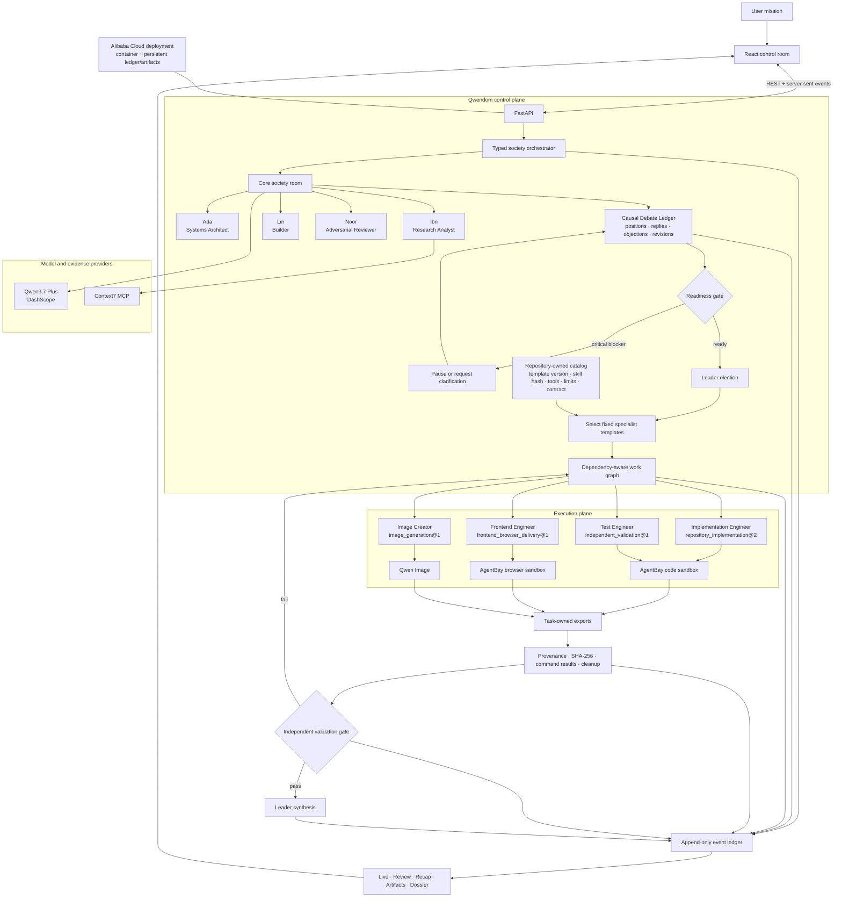

# Qwendom architecture

Qwendom is an accountable Qwen agent society. Its central design choice is to keep **deliberation**, **execution**, and **acceptance** separate:

- the core society debates and governs;
- fixed specialists execute bounded jobs;
- an independent specialist validates the exported result.

That separation lets the product show exactly where a claim came from, who owned the work, which tool ran, what failed, what changed, and why the terminal state is justified.

## System map

## Control plane: agents can propose, policy decides

Agno runs Qwen-backed agent turns, structured outputs, and memory. Qwendom keeps authorization and lifecycle policy in repository-owned code.

The model may propose a leader, a work graph, or a specialist selection. It cannot:

- create a specialist template;
- add tools to a specialist;
- change a pinned skill;
- bypass readiness or independent validation;
- convert an unexported sandbox path into a product artifact;
- erase a failed check or unresolved cleanup event.

## Core society roles

The persistent society owns governance and remains distinct from the execution employees.

| Core role | Governs | Tool boundary |
|---|---|---|
| Ada / Architect | decomposition, interfaces, ownership, architectural risk | read and planning tools; no product-file writes |
| Ibn / Researcher | evidence, uncertainty, current technical context | allowlisted Context7 and evidence lookup |
| Lin / Builder | feasibility, implementation plan, delivery sequencing | planning and bounded execution capabilities |
| Noor / Critic | adversarial review, blockers, acceptance rubric | review and acceptance tools; no product-file writes |

The core roles can vote. Execution specialists are non-voting employees selected after readiness.

## Fixed specialist catalog

`backend/society/capability_registry.py` defines the production catalog. Each immutable template contains:

- a template and version;
- declared capabilities;
- allowed and required tool IDs;
- one or more versioned skill references with SHA-256 hashes;
- concurrency, timeout, and network policy;
- conflict domains for scheduling;
- an artifact contract declaring production and validation rights.

| Specialist | Skill | Required tools | Acceptance boundary |
|---|---|---|---|
| Implementation Engineer | `repository_implementation@2` | start environment, execute command, export artifact, close environment | produces repository artifacts; independent validation required |
| Test Engineer | `independent_validation@1` | start environment, execute command, inspect artifact, report validation, close environment | validates exports without changing product files |
| Image Creator | `image_generation@1` | generate, inspect, and publish image | produces media; independent validation required |
| Frontend Engineer | `frontend_browser_delivery@1` | start environment, execute command, browser render, export artifact, close environment | produces UI plus render evidence; independent validation required |

The runtime normalizes skill line endings, verifies each pinned hash, and computes a hash for the resolved tool-and-skill bundle. This makes a specialist invocation replayable and prevents prompt output from silently expanding authority.

## AgentBay execution boundary

Implementation, testing, and frontend work use AgentBay rather than a generic hosted-code service.

1. Qwendom starts a task-scoped environment with the configured code or browser image.
2. The specialist receives only the tools in its resolved template.
3. Commands, code runs, file reads/writes, browser renders, and failures emit typed evidence.
4. Explicit outputs are exported from the environment and stored as task-owned artifacts.
5. Qwendom records provenance and SHA-256 digests.
6. The environment closes; incomplete cleanup remains a blocker.
7. A separate Test Engineer inspects the exported evidence and reports the acceptance verdict.

## Event-sourced product surface

The append-only ledger is the source for every visible view:

- **Live** shows the active phase, participants, replies, tools, and blockers.
- **Review** shows ownership, acceptance evidence, and independent validation.
- **Recap** reconstructs the rejected approach, material revision, and decision path.
- **Artifacts** exposes exported bytes, producer, provenance, hash, and validation state.
- **Dossier** reconstructs one participant's contributions from the same events.

The UI does not manufacture a clean state. If an expected event or artifact is missing, the projection shows the gap.

## Deployment boundary

The React build, FastAPI API, event projections, and verified artifact downloads ship in one container on Alibaba Cloud. Persistent storage keeps the event ledger and exported artifacts across restarts. The service uses outbound HTTPS for DashScope and AgentBay; Context7 runs through the configured MCP command when enabled.

See [Alibaba Cloud deployment](ALIBABA_CLOUD_DEPLOYMENT.md) for the operational configuration and acceptance checks.
