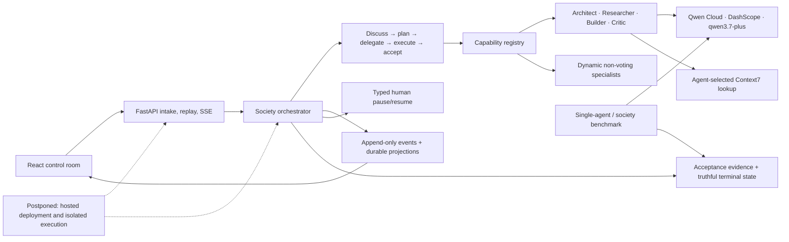

# Qwendom hackathon architecture

Qwendom is an accountable Agent Society: Qwen-powered specialists decompose a
task, select capabilities, challenge proposals, vote, execute bounded work,
and preserve the evidence required to justify the terminal state.

## Runtime truth

- Governance membership is separate from task participation. Dynamic
  specialists contribute evidence but do not automatically vote.
- Missing user input, missing system capability, and safety/policy constraints
  block execution. Risks and future work remain visible without creating a
  circular pause.
- Provider calls use bounded retries, honor `Retry-After`, preserve
  cancellation, and redact credentials from surfaced failures.
- The Researcher—not a prompt keyword—decides whether Context7 is useful. Its
  tool call records objective, query, expected evidence, and result provenance.
- Execution completion is not acceptance. Required evidence controls whether a
  task is `complete`, `complete_with_warnings`, `remediation`, or `failed`.

Hosted deployment and a general isolated execution environment are deliberately
shown as future boundaries because they were postponed and must not be implied
as completed submission evidence.
