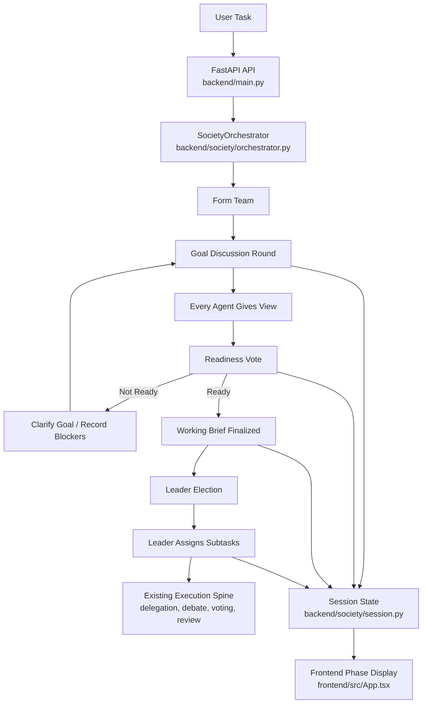

# Pre-Execution Conversation Workflow

This document defines the planned conversation-first workflow for Qwendom Agent
Society. It sits between task receipt and the existing execution spine described
in [AGNO_ACTIVATION_PLAN.md](./AGNO_ACTIVATION_PLAN.md).

The purpose is to make the agents agree on what the user is asking for before
they elect a leader, assign work, or produce competing solutions.

## Objective

The target workflow should:

1. let every agent interpret the user goal before work starts,
2. gate execution behind an explicit readiness vote,
3. loop back into discussion when the goal is still unclear,
4. produce a persisted working brief when readiness passes,
5. elect a leader only after the working brief exists,
6. let the leader assign subtasks from that brief, and
7. show each phase clearly in the frontend.

The working brief is an intentional addition to the user-facing flow. It is the
handoff artifact created after readiness passes, so leader election and subtask
assignment are based on the same shared understanding.

The success condition is not longer conversation. The success condition is a
traceable shift from "agents reacted to a prompt" to "agents aligned on the
goal, agreed they were ready, then started work."

## Target Flow



## Non-Goals

This plan does not aim to:

- replace native debate or voting tools,
- remove the current orchestrator in one step,
- redesign the whole frontend,
- require unanimity for every task,
- remove deterministic no-key mode, or
- let agents discuss indefinitely.

## Current Gap

The current runtime already has team formation, leader election, negotiation,
voting, delegation, artifacts, metrics, and memory. The missing concept is a
pre-execution alignment gate.

The desired order is:

1. form team,
2. discuss the goal,
3. vote on readiness,
4. loop if not ready,
5. freeze a working brief,
6. elect leader,
7. assign subtasks,
8. execute.

That differs from a workflow that elects a leader before the agents have agreed
what the task means.

## Guardrails

1. Preserve the current event stream and replay behavior.
2. Preserve deterministic fallback behavior.
3. Make new session state additive before making it authoritative.
4. Put loop budgets on all discussion and readiness phases.
5. Treat the working brief as the handoff contract into execution.
6. Do not let the UI hide blockers or failed readiness votes.

## New Session State

Additive fields:

```json
{
  "goal_discussions": [],
  "readiness_ballots": [],
  "readiness_tally": {},
  "ready_to_proceed": null,
  "discussion_round_count": 0,
  "readiness_attempt_count": 0,
  "working_brief": null
}
```

Recommended discussion statement shape:

```json
{
  "round": 1,
  "agent_id": "critic",
  "interpretation": "What this agent thinks the user wants.",
  "success_criteria": ["Concrete condition that would make the run successful."],
  "concerns": ["Ambiguity, risk, missing input, or disagreement."],
  "suggested_scope": "The smallest useful scope to execute."
}
```

Recommended readiness ballot shape:

```json
{
  "attempt": 1,
  "agent_id": "researcher",
  "ready": true,
  "critical_blocker": false,
  "reason": "Why the agent is ready or not ready.",
  "required_clarification": null
}
```

Recommended working brief shape:

```json
{
  "summary": "Shared understanding of the task.",
  "agreed_scope": "What the team will do now.",
  "success_criteria": [],
  "constraints": [],
  "open_questions": [],
  "blocked_items": [],
  "confidence": 0.82
}
```

## New Events

| Event | Purpose | Payload |
|---|---|---|
| `goal_discussion_started` | Marks a new discussion round | `round`, `max_rounds` |
| `agent_goal_opinion` | One agent's view of the goal | discussion statement |
| `readiness_vote_cast` | One agent's readiness vote | readiness ballot |
| `readiness_vote_tallied` | Round-level readiness result | tally, passed, blockers |
| `working_brief_finalized` | Shared brief accepted | working brief |
| `leader_election_started` | Leadership vote begins after readiness | working brief summary |
| `subtasks_assigned_from_brief` | Leader assigned work from brief | subtask ids, leader id |

Existing events such as `leader_elected`, `tool_call`, `vote_cast`,
`ballots_tallied`, and `task_complete` should remain valid.

## Phase A: Goal Discussion Rounds

### Goal

Give every team member a chance to define the goal before execution begins.

### Files

- `backend/society/orchestrator.py`
- `backend/society/session.py`
- optional `backend/society/schemas/conversation.py`

### Changes

1. Add a pre-execution method such as `_run_goal_discussion_round()`.
2. For each team member, collect a structured discussion statement.
3. Store each statement in `goal_discussions`.
4. Emit `goal_discussion_started` and `agent_goal_opinion` events.
5. Increment `discussion_round_count`.

### Acceptance Criteria

- every active member contributes exactly once per round,
- each contribution has an interpretation and at least one success criterion or
  concern,
- deterministic mode can produce stable fallback statements,
- the UI can group opinions by round.

## Phase B: Readiness Voting Loop

### Goal

Decide whether the society is ready to start work or needs another discussion
round.

### Files

- `backend/society/orchestrator.py`
- `backend/society/session.py`
- optional `backend/society/schemas/conversation.py`

### Changes

1. Add `_run_readiness_vote()`.
2. Each agent casts a readiness ballot.
3. Store ballots in `readiness_ballots`.
4. Emit `readiness_vote_cast` per ballot.
5. Tally votes and emit `readiness_vote_tallied`.
6. If the vote fails and the loop budget remains, run another discussion round
   with the blockers in context.

### Readiness Policy

Recommended first policy:

- pass when strictly more than half of active members vote ready,
- fail when any critical blocker exists,
- fail when the ready vote count is tied or below half,
- when the loop budget is exhausted, ask the user if critical blockers remain;
  otherwise proceed only with documented assumptions.

This avoids requiring unanimity while still respecting serious objections.

### Loop Budget

Recommended defaults:

- `max_discussion_rounds = 3`
- `max_readiness_attempts = 3`

Each failed readiness attempt triggers exactly one additional discussion round.
The next discussion round must receive the failed vote reasons and critical
blockers as context.

The final attempt must end in one of three explicit states:

- `ready_to_proceed = true`
- `ready_to_proceed = false` with a user-question event when critical blockers
  remain
- `ready_to_proceed = true` with documented assumptions when there are no
  critical blockers and a strict majority is ready

No silent continuation.

## Phase C: Working Brief

### Goal

Freeze the shared task understanding after readiness passes.

### Files

- `backend/society/orchestrator.py`
- `backend/society/session.py`
- optional `backend/society/schemas/conversation.py`

### Changes

1. Add `_compose_working_brief()`.
2. Use the orchestrator as the compatibility owner for composition.
3. In LLM mode, optionally ask the elected summarizer path to produce the brief;
   in deterministic mode, build the brief from recorded discussion fields.
4. Summarize the discussion statements, readiness vote reasons, and blockers.
5. Store the result in `working_brief`.
6. Emit `working_brief_finalized`.
7. Pass the brief into leader election and subtask assignment prompts.

### Acceptance Criteria

- the brief names the agreed scope,
- the brief names success criteria,
- unresolved questions are preserved rather than erased,
- downstream phases can cite the brief.

## Phase D: Leader Election After Readiness

### Goal

Elect the leader based on the agreed brief, not before it exists.

### Files

- `backend/society/orchestrator.py`
- `backend/society/tools/governance.py`
- `backend/society/schemas/governance.py`

### Changes

1. Move leader election after the working brief phase.
2. Include the working brief in the election context.
3. Preserve the existing `leader_elected` event.
4. Optionally emit `leader_election_started` before the vote.

### Acceptance Criteria

- no leader is elected before `ready_to_proceed` is true,
- `ready_to_proceed = null` and `ready_to_proceed = false` both block leader
  election,
- election reasons reference the working brief,
- deterministic mode still elects a leader predictably.

## Phase E: Leader Subtask Assignment

### Goal

Let the elected leader turn the working brief into concrete assignments.

### Files

- `backend/society/orchestrator.py`
- `backend/society/tools/delegation.py`
- `backend/society/schemas/delegation.py`
- `backend/society/session.py`

### Changes

1. Add or adapt a method such as `_leader_assign_subtasks()`.
2. Use the working brief as the source of scope and done criteria.
3. Create one useful assignment per active role where possible.
4. Store assignments in `subtasks`.
5. Emit `subtasks_assigned_from_brief`.

### Acceptance Criteria

- each assignment has an owner, objective, expected output, and done criteria,
- assignments reference the working brief or its agreed scope,
- blocked or unassigned agents are explicit,
- the existing delegation lifecycle can continue after assignment.

## Phase F: UI Phase Display

### Goal

Make the conversation workflow visible instead of hiding it in a flat timeline.

### Files

- `frontend/src/App.tsx`
- `frontend/src/styles.css`
- `frontend/src/api.ts`

### Changes

1. Add new event types to the SSE event list.
2. Add icons for discussion, readiness, working brief, and assignments.
3. Group timeline events by phase:
   - Goal Discussion
   - Readiness Vote
   - Working Brief
   - Leader Election
   - Subtask Assignment
   - Work / Review, using existing delegation, debate, vote, and monitor events
   - Final Answer, using the existing `task_complete` event
4. Show discussion round numbers.
5. Show readiness vote tally and blockers.
6. Show the current phase near task status.

### UI Acceptance Criteria

- users can see why agents did or did not start,
- repeated discussion rounds are visually distinct,
- readiness blockers are visible without opening raw JSON,
- the elected leader and assigned subtasks are visible as phase outcomes,
- replayed tasks show the same phase structure.

## Feature Flags

Recommended flags:

- `PRE_EXECUTION_CONVERSATION_ENABLED=false`
- `READINESS_VOTING_ENABLED=false`

Optional later flags:

- `WORKING_BRIEF_ENABLED=false`
- `PHASED_TIMELINE_ENABLED=false`

Start with the first two. The point is rollback, not configuration sprawl.

## Rollback Strategy

If the new workflow fails, the system should be able to skip directly from team
formation to the existing execution spine.

Rollback triggers:

- required existing events disappear,
- deterministic runs fail,
- readiness loops exceed budget without a bounded outcome,
- leader election runs before readiness,
- the frontend event stream breaks,
- replay cannot render older tasks.

## Cross-Phase Risks

- Discussion can become verbose without improving the task.
- Requiring unanimity can block execution too often.
- Majority voting can ignore a legitimate critical blocker.
- Working brief quality determines subtask quality.
- More phases means more LLM calls and higher latency.
- UI grouping can hide important raw events if implemented too aggressively.

## Validation Matrix

For implementation work derived from this plan:

```powershell
python -m compileall backend
cd backend; python -m society.preflight
cd frontend; npm run build
```

Behavioral checks:

- deterministic run with one successful readiness vote,
- deterministic run that loops once before readiness,
- LLM-backed run with visible discussion statements,
- run where a critical blocker prevents immediate execution,
- run that reaches leader election only after readiness,
- run where leader assigns subtasks from the working brief,
- replay check for all new event types.

## Immediate Next Sprint

The smallest useful sprint is:

1. add session fields for discussions, readiness, and working brief,
2. add event names and frontend event handling,
3. add deterministic discussion and readiness loop,
4. move leader election behind the readiness gate under a feature flag,
5. show discussion rounds and readiness tally in the UI.

Do not start by making the conversation smarter. Start by making the workflow
shape correct, bounded, replayable, and visible.
